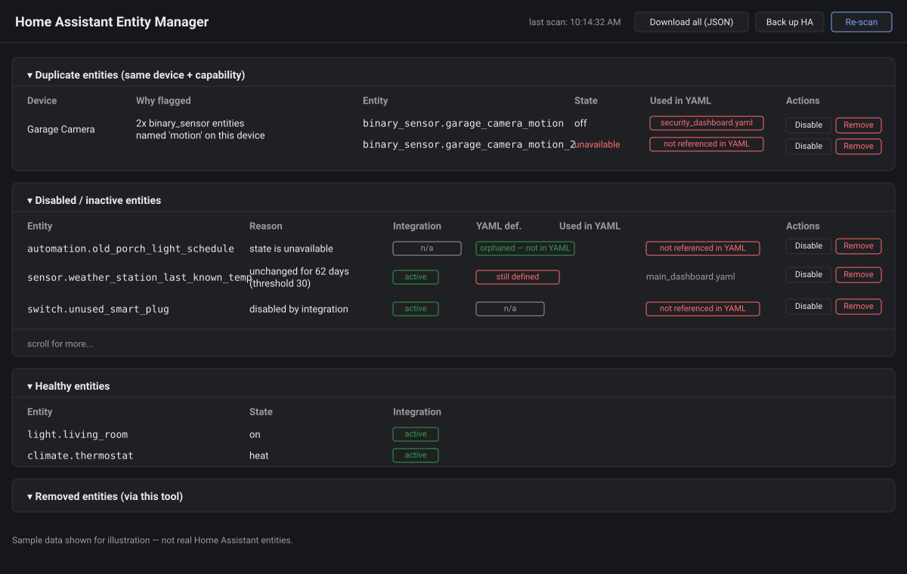

# ha-entity-manager

[](https://github.com/sambena/ha-entity-manager/actions/workflows/ci.yml)
[](LICENSE)

Local dashboard for reviewing Home Assistant entity duplicates, disabled/inactive
entities, and YAML drift against the live entity registry. Runs entirely on your
machine; nothing is written to Home Assistant except when you click Disable/Remove
and confirm.



## Prerequisites

- **Python 3.10+**. Check with `python --version`; if it's missing on Windows,
  `winget install --id Python.Python.3.12 -e`.
- **PyYAML**: `python -m pip install pyyaml`
- Network access to your Home Assistant instance's REST/WebSocket API and to its
  **live** config directory (see `yaml_root` below) — e.g. a Samba/SMB share like
  `\\<ha-host>\config` if you're running Home Assistant OS/Supervised.

## Setup

1. Clone the repo:
   ```bash
   git clone https://github.com/sambena/ha-entity-manager.git
   cd ha-entity-manager
   ```
2. Copy the example config and edit it for your instance (host, and `yaml_root`
   pointing at your **live** config share, e.g. `\\192.168.1.100\config` — not a
   local backup/clone, see the `yaml_root` note below):
   ```bash
   copy config.example.json config.json
   ```
3. Generate a long-lived access token in Home Assistant (Profile -> Security ->
   Long-Lived Access Tokens) and set it as an environment variable:
   ```powershell
   $env:HOME_ASSISTANT_TOKEN = "your-token-here"
   ```
4. Run the server:
   ```bash
   python server.py
   ```
5. Open http://localhost:8765 (or whatever `server_port` you set).

## Configuration (`config.json`)

| Field | Meaning |
| --- | --- |
| `ha_host` / `ha_port` / `ha_use_ssl` | Where Home Assistant lives |
| `yaml_root` | Path to the **live** HA config directory (must contain `tools/validate_bundle.py`). Point this at the live `\\<host>\config` share, not a local clone/backup — a stale local copy will make "Used in YAML" and YAML drift report against files that no longer reflect what's actually running. |
| `inactive_days` | How long an entity's state must be unchanged before it's flagged inactive |
| `server_port` | Port this dashboard listens on |

The access token is never stored in `config.json` — it's read from
`HOME_ASSISTANT_TOKEN`, or pass `--token` on the command line for a one-off run.
Any field in `config.json` can also be overridden per-run: `--host`, `--port`,
`--root`, `--server-port`, `--config <path>`.

## What it does

- **Duplicates**: groups entity-registry entries by device + capability
  (domain/device_class/unit) and flags devices with more than one entity for
  the same capability.
- **Disabled/inactive**: entities already disabled in the registry, or enabled
  entities whose state is `unavailable`/`unknown`/unchanged past the
  `inactive_days` threshold.
- **YAML drift**: reuses `tools/validate_bundle.py`'s YAML loader to find
  duplicate `unique_id`s and entity-id references in your YAML bundle that no
  longer exist in the live registry.
- **Healthy entities**: everything not flagged as a duplicate or inactive, shown
  with the same signals below so you can spot-check anything, not just what got
  flagged.

Every duplicate and inactive/disabled entity is also shown with two extra signals to
help you judge whether it's safe to touch:
- **Used in YAML**: every automation/script/dashboard/template file that references
  the entity_id (found by scanning the whole YAML bundle), or a "not referenced in
  YAML" warning badge if nothing does.
- **Integration**: whether the entity's owning integration is currently loaded and
  enabled in HA (`active`), or a warning badge if it's disabled/not loaded/unknown,
  or `n/a` for entities not backed by a config-entry integration (YAML helpers,
  template sensors, etc.).
- **YAML def.**: for hand-authored domains (`automation`, `script`, `input_boolean`,
  `input_number`, `input_text`, `input_select`, `input_datetime`,
  `alarm_control_panel`) that aren't backed by a config-entry integration, whether a
  matching definition still exists in the live YAML (matched by `unique_id`/`id`, not
  just entity_id text, since an automation's alias and its `id` can differ). A green
  "orphaned — not in YAML" badge means the YAML block was already deleted and this
  registry entry is just leftover cruft — the strongest signal that removing it is
  safe. `n/a` for integration-backed entities, where this check doesn't apply.

Every scan is read-only. Disable/Remove actions apply to exactly one entity and
only run when you click the button — nothing is bulk-applied automatically. The
tool does not edit YAML files itself; drift issues show file locations so you can
fix them by hand.

## Safety features

- **Confirm modal**: clicking Disable/Remove opens a modal with a verdict
  (safe/risky/mixed) built from the entity's "used in YAML" / "integration
  active" / "YAML def." signals, plus its current state — not a plain
  yes/no confirm.
- **Back up HA**: header button that triggers a real Home Assistant backup
  (core config + database) before you start making changes.
- **Removed entities + Restore**: every Remove snapshots the entity's full
  registry record first. The "Removed entities" section lists them with a
  Restore button, which reloads the owning integration and reapplies saved
  settings if possible — but this is best-effort, not a guaranteed undelete
  (HA's API has no true "undo" for a YAML-defined entity with no owning
  integration; see the in-app messaging when you try).

## Dashboard UI

- **Sortable columns**: click any column header to sort; click again to reverse.
  Sort choice persists across re-scans.
- **Resizable columns**: drag the handle on the right edge of a column header.
  Widths persist across re-scans/sorts (in-memory, per browser tab).
- **Collapsible sections**: click a section header to collapse/expand it.
- **JSON export**: each section has a "JSON" button (top-right of its header) to
  download just that section's current data; "Download all" in the top header
  exports every section (including Removed entities) as one file.
